<p align="center">
  
  
  
  
</p>

<h1 align="center">CODY-ORCHESTRA</h1>
<p align="center"><strong>Local-first AI coding agent. CLI, TUI, web UI, and 20+ providers — one tool to rule them all.</strong></p>

codyx is an open-source AI coding agent that runs entirely on your machine. It combines a
full-featured terminal UI, a headless API server, and a web dashboard into a single binary.
Connect any AI provider, manage sessions and projects, automate infrastructure, and extend
everything through plugins, agents, and custom tools.

---

## Quick Start

```bash
# macOS / Linux
curl -fsSL https://raw.githubusercontent.com/mufasa1611/cody-orchestra/main/script/install.sh | bash

# Windows PowerShell
irm https://raw.githubusercontent.com/mufasa1611/cody-orchestra/main/script/install.ps1 | iex

# Launch the TUI
codyx
```

> The Windows installer sets up Git and [Bun](https://bun.sh) 1.3.13+ when possible,
> pauses for email ownership verification, installs `codyx` for the current user, and
> verifies the global command before finishing. A valid saved verification receipt lets
> later runs continue automatically.
> Docker images are available for headless/server deployments.

---

## Why codyx?

Most AI coding tools are either SaaS-locked (your code leaves your machine), CLI-only (no UI),
or single-provider. codyx is different:

|                      | codyx | GitHub Copilot CLI | Claude Code | Aider |
|----------------------|-------|-------------------|-------------|-------|
| **Local-first**      | ✅     | ❌ SaaS-dependent | ❌ API-only | ✅    |
| **Terminal UI**      | ✅     | ❌                | ✅          | ❌    |
| **Web UI**           | ✅     | ❌                | ❌          | ❌    |
| **Multi-provider**   | ✅ 20+ | ❌ Copilot only   | ❌ Anthropic | ❌ OpenAI |
| **Multi-user server**| ✅     | ❌                | ❌          | ❌    |
| **Plugin system**    | ✅     | ❌                | ❌          | ❌    |
| **Infra tools**      | ✅     | ❌                | ❌          | ❌    |
| **Open source**      | ✅ MIT | ❌                | ❌          | ✅ Apache |

---

## Screenshots

> *[Screenshots placeholder — TUI session view, web UI dashboard, CLI command output]*


## Features

### Three Interfaces, One Backend
- **TUI** — Full-screen terminal UI with themes, keybindings, multi-session tabs, dialog
  system, and scrollback. Built with `@opentui/solid`.
- **CLI** — 30+ subcommands for scripting, automation, and CI/CD pipelines. Parseable output,
  pipe-friendly.
- **Web UI** — Browser-based dashboard at `http://localhost:4097`. Session viewer, provider
  management, user admin. Built with SolidJS + Vite.

### 20+ AI Providers
OpenAI · Anthropic · Google Gemini · Google Vertex · AWS Bedrock · Azure OpenAI ·
Groq · Mistral · Perplexity · Together AI · DeepInfra · xAI (Grok) · Cerebras ·
Alibaba (Qwen) · GitHub Copilot · OpenRouter · GitLab Duo AI · Venice AI ·
Cloudflare AI Gateway · Ollama (local) · llama.cpp (local)

Switch between providers per-session or per-command. No vendor lock-in.

### Agent System
Pluggable agents with permission boundaries, custom tools, and skill definitions:

| Agent | Purpose |
|-------|---------|
| `operator` | General-purpose coding and automation |
| `infra-audit` | Read-only infrastructure inspection |
| `windows-admin` | Windows system diagnostics |
| `ssh-operator` | Remote host inspection over SSH |
| `docker-operator` | Docker container and image inspection |
| `systemd-operator` | Linux systemd service audit |
| `proxmox-operator` | Proxmox VM/container inventory |
| `backup-operator` | Backup file inventory and checksum |
| `web-research` | Web search and source-backed research |

### Multi-User Server
Built-in authentication (JWT, OpenAuth), per-user sessions, role-based access, and
rate limiting. Run `codyx serve` to start the headless API server — your team connects
through the web UI or the CLI.

### Project & Session Management
- Multi-workspace with VCS-aware context
- Per-project configuration and state
- Persistent sessions with undo, retry, compaction, and structured output
- Event-sourced sync across devices
- Export and import sessions between instances

### MCP / ACP Support
Model Context Protocol and Agent Client Protocol for interoperable tool ecosystems.
Connect MCP servers, expose local tools, and integrate with the broader AI tooling landscape.

### Plugin System
Three extension surfaces:
- **npm plugins** — Full plugins published to npm
  - **Local tools** — .cody/{tool,tools}/*.{ts,js} scripts loaded as CLI tools
  - **Local plugins** — .cody/{plugin,plugins}/*.{ts,js} for system extensions
  - **Agent definitions** — .cody/{agent,agents}/**/*.md for custom agent configurations


### Private by Default
- **Private project data** — Codyx does not collect your code, prompts, conversations, or project content. After email verification succeeds, the official Windows installer records the display name and verified email address you provide and sends an operational registration notice to the Codyx administrator. The notice never contains the verification code. The display name is not independently verified, the data is not used for marketing, and deletion can be requested at `privacy@kingkung.men`; see [the installer privacy notice](https://install.kingkung.men/privacy). Manual clones and repository downloads are not tracked by this installer service.
- **No cloud dependency** — Works fully offline with local models (Ollama, llama.cpp)
- **Local database** — All sessions, config, and state stored in local SQLite
- **Self-contained** — Single binary with no external service requirements

---

## CLI Commands

| Command | Description |
|---------|-------------|
| `codyx` | Launch the terminal UI |
| `run` | Run a one-shot task from the command line |
| `serve` | Start the headless HTTP API server (port 4097) |
| `web` | Start the web UI server |
| `session` | List, view, and manage sessions |
| `providers` | Manage AI provider configurations |
| `models` | List available models from all providers |
| `agent` | Run a specific agent (`operator`, `infra-audit`, etc.) |
| `mcp` | Manage MCP server connections |
| `acp` | Manage ACP agent connections |
| `plugin` | Install and manage plugins |
| `github` | Manage GitHub PRs and issues from the CLI |
| `pr` | Create and review pull requests |
| `setup` | First-run setup wizard |
| `doctor` | Diagnose installation and configuration issues |
| `upgrade` | Update to the latest version |
| `export` / `import` | Transfer sessions between instances |
| `stats` | Show usage statistics |
| `users` | Manage server users (multi-user mode) |
| `debug` | Debug tools (LSP, ripgrep, snapshot, skills) |

### Usage Examples

```bash
# One-shot task
codyx run "explain this project structure"

# Start server for team access
codyx serve --port 4097

# Use a specific agent
codyx agent infra-audit

# List all available models
codyx models

```

---


## Architecture

```mermaid
flowchart TB
    classDef interface fill:#6366f1,color:#fff,stroke:#4f46e5,stroke-width:2px
    classDef gateway fill:#0ea5e9,color:#fff,stroke:#0284c7,stroke-width:2px
    classDef core fill:#8b5cf6,color:#fff,stroke:#7c3aed,stroke-width:2px
    classDef data fill:#10b981,color:#fff,stroke:#059669,stroke-width:2px
    classDef external fill:#f59e0b,color:#fff,stroke:#d97706,stroke-width:2px,stroke-dasharray:5 3
    classDef infra fill:#ec4899,color:#fff,stroke:#db2777,stroke-width:2px

    subgraph Interfaces ["🎨 User Interfaces"]
        TUI["Terminal UI<br/><small>@opentui/solid</small>"]:::interface
        CLI["CLI<br/><small>yargs · 30+ commands</small>"]:::interface
        WEB["Web UI<br/><small>SolidJS + Vite</small>"]:::interface
    end

    subgraph Gateway ["🌐 Gateway"]
        HONO["Hono HTTP API<br/><small>port 4097 · OpenAPI</small>"]:::gateway
        WS["WebSocket<br/><small>session streams</small>"]:::gateway
        MCP_ACP["MCP / ACP<br/><small>protocol endpoints</small>"]:::gateway
    end

    subgraph Engine ["⚡ Effect Runtime v4"]
        SESS["Sessions<br/><small>persistent · undo · retry</small>"]:::core
        PROJ["Projects<br/><small>multi-workspace · VCS-aware</small>"]:::core
        PROV["Providers<br/><small>20+ AI backends</small>"]:::core
        AGT["Agent System<br/><small>operator · infra-audit · ssh · docker · web</small>"]:::core
        PLG["Plugin Engine<br/><small>npm plugins · local tools</small>"]:::core
        SYNC["Event Sync<br/><small>cross-device · export/import</small>"]:::core
    end

    subgraph Data ["💾 Data Layer"]
        DB["SQLite<br/><small>Drizzle ORM · 19 migrations</small>"]:::data
        FS["Filesystem<br/><small>config · workspaces · state</small>"]:::data
        CACHE["Cache<br/><small>model discovery · embeddings</small>"]:::data
    end

    subgraph External ["🔌 External Integrations"]
        AI["AI Providers<br/><small>OpenAI · Anthropic · Google<br/>AWS · Azure · Ollama · more</small>"]:::external
        INFRA["Infra Inspection<br/><small>Docker · SSH · Proxmox<br/>systemd · Windows</small>"]:::infra
        VCS["Version Control<br/><small>Git · GitHub PRs</small>"]:::infra
        SEARCH["Search Engine<br/><small>tree-sitter · ripgrep</small>"]:::infra
    end

    TUI & CLI & WEB --> HONO & WS
    HONO & WS & MCP_ACP --> SESS & PROJ & PROV & AGT & PLG & SYNC
    SESS & PROJ & PROV & AGT & PLG & SYNC --> DB & FS & CACHE
    PROV --> AI
    AGT --> INFRA & VCS & SEARCH
```



| Layer | Technology |
|-------|-----------|
| Runtime | Bun (primary) / Node.js 22+ |
| Language | TypeScript (strict, ESM) |
| TUI | `@opentui/solid` (SolidJS-based terminal UI) |
| Web UI | SolidJS + Vite |
| HTTP API | Hono with OpenAPI spec generation |
| Database | SQLite via Drizzle ORM (19 migration versions) |
| State Management | Effect v4 (composable, typed workflows) |
| Protocols | ACP, MCP, JSON-RPC, WebSocket |
| Search | tree-sitter, fuzzysort |

---

## Environment Variables

| Variable | Description |
|----------|-------------|
| `CODY_REFRESH_MODELS` | Set to `1` to force local model re-discovery |
| `CODY_SKIP_MODEL_DISCOVERY` | Set to `1` to skip model discovery on startup |
| `CODY_X=0` | Disable codyx branding, fall back to upstream styling |
| `XDG_DATA_HOME` | Override data directory (default: `~/.local/share/codyx`) |
| `codyproXMOX_URL` | Proxmox API endpoint for infra inspection |
| `codyproXMOX_TOKEN_ID` | Proxmox API token ID |
| `codyproXMOX_TOKEN_SECRET` | Proxmox API token secret |

---

## Use Cases

- **Solo Developer** — AI assistance with local models, no data leaves your machine
- **DevOps / SRE** — Infrastructure inspection across Windows, Linux, Docker, Proxmox,
  and SSH hosts through natural language
- **Team Server** — Deploy `codyx serve` on a shared box for multi-user access with auth
- **CI/CD Pipeline** — `codyx run` for automated code review, changelog generation, and
  PR management in GitHub Actions
- **Research** — Web research agent for source-backed investigations with citation formatting
- **Cross-Platform** — Windows, macOS, Linux with consistent behavior

---

## Ecosystem

codyx is the core of a broader ecosystem:

| Package | Description |
|---------|-------------|
| `packages/codyx` | Main CLI, TUI, and server |
| `packages/app` | Web UI (SolidJS) |
| `packages/desktop` | Electron desktop wrapper |
| `packages/web` | Standalone web package |
| `packages/slack` | Slack bot integration |
| `packages/core` | Shared core library (`@cody/core`) |
| `packages/plugin` | Plugin system (`@cody/plugin`) |
| `packages/sdk` | JavaScript SDK (`@cody/sdk`) |
| `packages/enterprise` | Enterprise features |
| `sdks/vscode` | VS Code extension SDK |

---

## Configuration

User config lives in `.cody/cody.jsonc` (project root or home directory):

```jsonc
{
  "model": "openai/gpt-4o",
  "provider": {
    "ollama": {
      "name": "Ollama (local)",
      "options": {
        "baseURL": "http://localhost:11434/v1"
      }
    }
  },
  "agent": "operator",
  "permission": {
    "edit": "ask",
    "bash": "ask"
  },
  "theme": "catppuccin",
  "keybinds": { ... },
  "skills": [ ... ]
}
```

Use `codyx setup` for an interactive wizard or edit the file directly.

---

## Installation Options

### Docker
```bash
docker run -p 4097:4097 ghcr.io/mufasa1611/cody-orchestra:latest
```

### From Source
```bash
git clone https://github.com/mufasa1611/cody-orchestra.git
cd cody-orchestra
bun install
bun run dev
```

### Global npm Shim
```bash
npm install -g codyx-ai
codyx
```

---

## Documentation

- `CODYX_QUICKSTART.md` — Getting started guide
- `CODYX_INSTALL_UPDATE.md` — Installation and update strategy
- `CODYX_PROVIDER_POLICY.md` — Local-first provider policy
- `CODYX_LOCAL_MODELS.md` — Local model setup (Ollama, LM Studio)
- `CODYX_EXTENSION_POINTS.md` — Agent, tool, and plugin extension system
- `CODYX_INFRA_TOOLS.md` — Infrastructure inspection tools
- `CODYX_SAFETY_MODEL.md` — Permission and safety architecture
- `CODYX_WEB_RESEARCH.md` — Web research tools
- `AGENTS.md` — Agent instructions for AI-assisted development
- `CONTRIBUTING.md` — Contribution guidelines
- `SECURITY.md` — Security policy

---

## Development

```bash
# Clone
git clone https://github.com/mufasa1611/cody-orchestra.git
cd cody-orchestra

# Install dependencies
bun install

# Run typecheck
bun run typecheck

# Start in development mode (TUI)
bun run dev

# Start the API server
cd packages/codyx && bun run src/index.ts serve --port 4097 --print-logs --log-level DEBUG

# Run tests
cd packages/codyx && bun test

# Database migrations
cd packages/codyx && bun run db generate --name <migration-name>

# Build
cd packages/codyx && bun run build
```

### Project Structure

```
packages/
├── codyx/        # Main CLI, TUI, server, providers, agents
├── app/          # Web UI (SolidJS)
├── desktop/      # Electron desktop app
├── web/          # Standalone web package
├── slack/        # Slack bot
├── core/         # Shared core library (@cody/core)
├── plugin/       # Plugin system
├── sdk/          # JavaScript SDK
├── script/       # Shared scripts
├── enterprise/   # Enterprise features
└── containers/   # Docker container definitions
```

---

## Contributing

Contributions are welcome! See `CONTRIBUTING.md` for guidelines.

- Report bugs and request features through [GitHub Issues](https://github.com/mufasa1611/cody-orchestra/issues)
- Submit pull requests — PRs welcome
- Follow the coding style in `AGENTS.md`
- Run `bun run typecheck` and `bun test` before submitting

---

## License

MIT © 2026 Mufasa (M. Farid)
Uses the upstream [cody](https://github.com/mufasa1611/codypro) project as base (also MIT).
