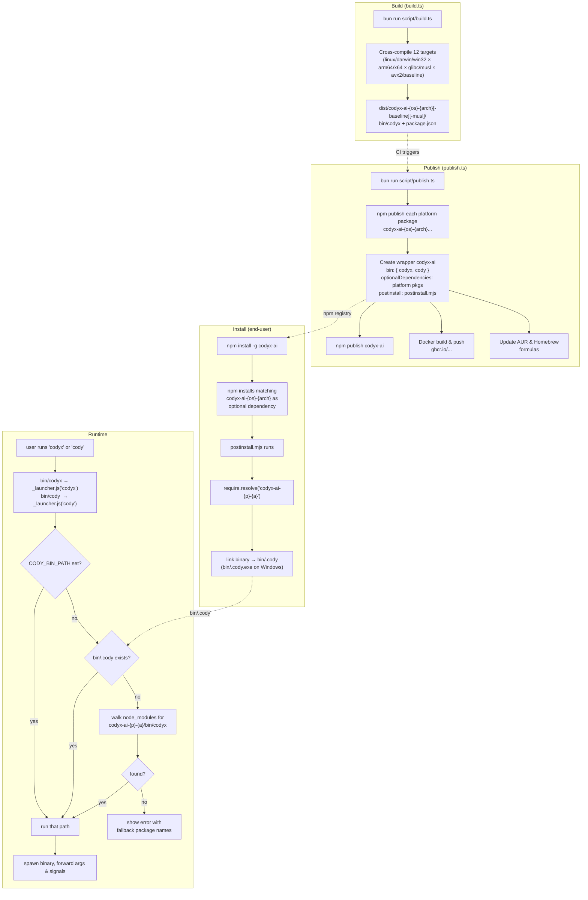

# codyx-ai

The npm release is published by `.github/workflows/publish-npm.yml`. The
repository must contain an `NPM_TOKEN` Actions secret with permission to
publish `codyx-ai` and its `codyx-ai-*` platform packages.

## Workflow

### Scripts

| Script | Purpose |
|---|---|
| `script/build.ts` | Cross-compile platform-specific standalone binaries via Bun.compile |
| `script/publish.ts` | Publish platform packages + wrapper to npm, Docker, AUR, Homebrew |
| `script/postinstall.mjs` | End-user postinstall: links correct platform binary into `bin/.cody` |
| `bin/_launcher.js` | Shared runtime launcher: finds & spawns the platform binary |
| `bin/codyx` | Thin wrapper → `_launcher('codyx')` |
| `bin/cody` | Thin wrapper → `_launcher('cody')` |
| `script/fix-node-pty.ts` | Dev-only: fix node-pty spawn-helper permissions (runs from root postinstall) |
| `script/generate.ts` | SDK code generation (imported by build.ts) |
| `Dockerfile` | Multi-arch Alpine image (libgcc, libstdc++, ripgrep) |
| `drizzle.config.ts` | Drizzle Kit schema/migration config
